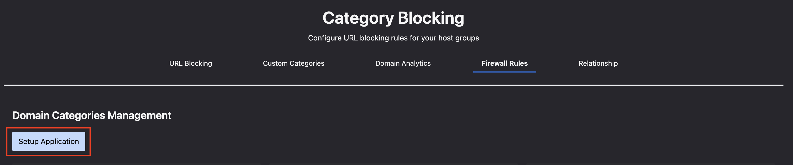

# Foundry Sample with URL Filtering

This sample is designed to show how to use URL Filtering in Falcon Foundry. It contains a few capabilities:

1. Python functions:

   - **urlblock**: Fetches host groups information
   - **categories**: Retrieves categories from collections
   - **create-rule**: Creates firewall management blocking rules
   - **domain-analytics**: Generates domain analytics information
   - **import-csv**: Transforms category domain CSV into collections
   - **list-categories**: Lists available categories
   - **search-categories**: Searches for specific categories
   - **manage-categories**: Creates or updates categories
   - **manage-relationship**: Creates relationships between categories, rule groups, and hosts
   - **get-relationship**: Retrieves relationship information
   - **update-rules**: Updates existing rules with new URLs

2. Collections for data storage:
   - **domain**: Stores URLs and category mappings
   - **relationship**: Stores relationship information about host groups, rule groups, and categories

3. UI Pages with React components:
   - **Home**: Main interface for creating firewall rules
   - **FirewallRules**: Management of domain categories
   - **DomainAnalytics**: Visualization of domain data
   - **Relationship**: Visualization of relationships between categories, rule groups, and host groups

## Application Setup

When you install this app, you will need to go to the Firewall Rules page and click on the "Setup Application" button to configure the application.

> **TIP**: You can import URL categories from a CSV file or manually add categories through the FirewallRules interface.

## Usage

After installing the app, follow these steps to get started:

1. **Creating URL Categories**
   - Navigate to the **FirewallRules** page
   - Click "Import Categories" to import from a CSV file, or manually add categories
   - View and manage your categories from this interface

2. **Creating Blocking Rules**
   - Navigate to the **Home** page
   - Enter a policy name and select a host group
   - Select the categories you want to block
   - Click "Preview URLs" to see what will be blocked
   - Click "Create blocking rule" to deploy the rule

3. **Viewing Analytics**
   - Navigate to the **DomainAnalytics** page
   - View charts and statistics about blocked domains
   - Analyze patterns and effectiveness of your blocking rules

4. **Visualizing Relationships**
   - Navigate to the **Relationship** page
   - Explore the connections between categories, rule groups, and host groups
   - Understand how your blocking rules are structured

The source code for this app can be found on GitHub: <https://github.com/CrowdStrike/foundry-sample-url-filtering>.
